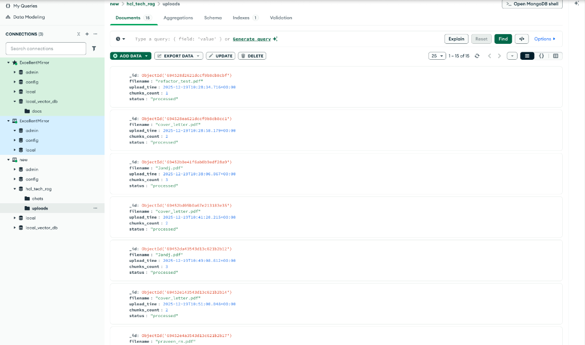
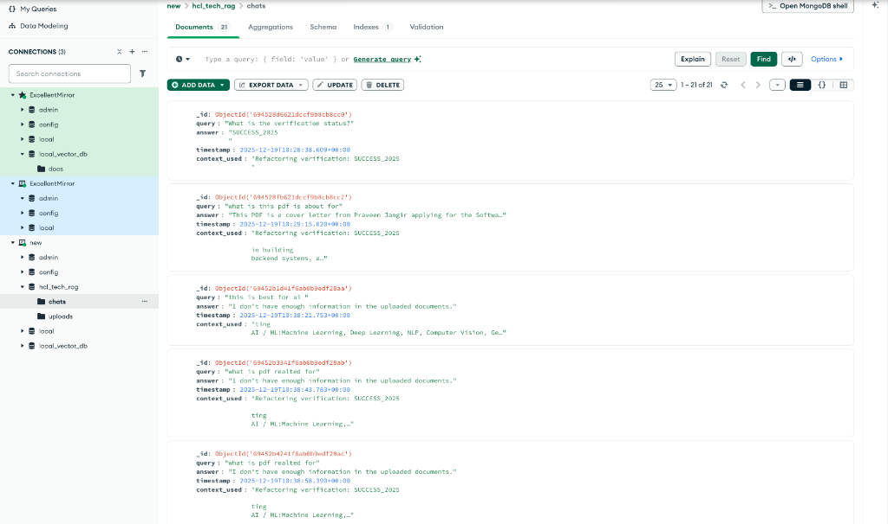

# HCL Tech Hackathon - AI Python Project

[](https://opensource.org/licenses/MIT)
[](https://www.python.org/downloads/)
[]()

> A cutting-edge AI solution designed for the HCL Tech Hackathon, leveraging Python to solve real-world problems through advanced machine learning algorithms.

---

## Table of Contents
- [About](#-about)
- [Architecture](#-architecture)
- [Key Features](#-key-features)
- [Requirements](#-requirements)
- [Tech Stack](#-tech-stack)
- [Installation](#-installation)
- [Usage](#-usage)
- [Team](#-team)

---

## About
The system accepts questions in a natural language (English) from the end user for the implied knowledge base to answer and resolve queries from the horde of PDF documents collected from open sources and fed to the system. The architecture supports any computer-readable PDF document and provides smart answers in natural language. The system provides answers to any query that is part of the knowledge base and ensures no outside knowledge invades the generated response.

---

## Architecture
This project utilizes a sophisticated pipeline to process documents and generate accurate responses.

### System Architecture


### Data Flow


### Workflow
1. **Document Processing**: `Pdf_doc` → **Txt_Extractor** → `Raw_Txt` (does OCR if length of extracted text is less than a predefined threshold).
2. **Embedding**: `Extracted_information` → **Embedding_FAISS_Indexing** → `Semantic Vector_Store`.
3. **Query Processing**: `User_Query` → **LLM** → `Summerized_txt_for_Semantic_Search`.
4. **Retrieval**: `Summerized_TXT` → **Vector_Query_Top_K** → `Top_Related_Documents`.
5. **Response Generation**: `Top_Related_Documents` → **LLM** → `Human_Friendly_Response`.
6. **Evaluation Set Creation**.
7. **Testing**: Ensuring proper knowledge extraction and knowledge base exclusive response extraction.
8. **Metrics**: Finding numerical evaluation metrics for evaluating system capability.

---

## Key Features

### 🚀 Dual-Model RAG Architecture
- **Internal Model**: Custom RAG pipeline using Google Gemini 2.0 Flash, ChromaDB, and Query Rewriting.
- **External Model Integration**: Real-time parallel querying of an external RAG system (hosted via ngrok) for cross-verification.
- **Dynamic Configuration**: Hot-swappable external API URL directly from the Dashboard UI.

### 📊 Advanced Evaluation Metrics
Real-time quality assessment for every internal RAG response:
- **Cosine Similarity**: Semantic grounding score.
- **ROUGE-1 / BLEU**: Text overlap and n-gram precision metrics.
- **MRR (Mean Reciprocal Rank)**: Retrieval quality score.

### 📂 Multi-Format Document Support
Intelligent processing pipeline for diverse inputs:
- **PDF & Text**: Standard extraction.
- **OCR Engine**: Standardized text extraction from **Images** (`.png`, `.jpg`).
- **Office Docs**: Native parsing for **Word** (`.docx`), **Excel** (`.xlsx`), and **PowerPoint** (`.pptx`).

### 💻 Modern Stack
- **Frontend**: **React + Vite** for a responsive, card-based comparison UI.
- **Backend**: **Flask-RESTx** for Swagger documentation and robust API handling.

---

## Tech Stack
| Category | Technology | Purpose |
| :--- | :--- | :--- |
| **Backend** | **Python (Flask)** | REST API, Orchestration, RAG Pipeline |
| **Frontend** | **React.js + Vite** | High-performance Client UI with Dual Cards |
| **LLMs** | **Gemini 2.0 Flash** | Query Rewriting, Answer Generation, Eval |
| **Vector DB** | **ChromaDB** | Semantic Search & Document Storage |
| **OCR/Parsing** | **Tesseract, Pandas** | Image & Tabular Data Extraction |
| **Database** | **MongoDB** | Chat History & Upload Logs |

---

## Installation

1. **Clone the repository**
   ```bash
   git clone https://github.com/your-username/hcl-hackathon-ai.git
   cd hcl-hackathon-ai
   ```

2. **Create Environment**
   ```bash
   conda create -n HCL python=3.10 -y
   conda activate HCL
   ```

3. **Install dependencies**
   ```bash
   pip install -r requirements.txt
   ```

4. **Run the application**
   ```bash
   streamlit run app.py
   ```

---


---

## Data Persistence & Schema
The system uses **MongoDB** to store chat history (`chats` collection) and file upload metadata (`uploads` collection). This ensures audit trails and evaluation datasets are preserved.

### Chat History Schema (`chats`)
Stores every user query, the internal RAG response (with metrics), and the external model response.


### File Uploads Schema (`uploads`)
Tracks all uploaded files, their processing status, chunk counts, and timestamps.


---

## Testing
We utilize personally handcrafted documents containing imaginary information for verification. This ensures that the end response is indeed only extracted from the knowledge base and no outside information invades the generated response, even after parsing through a SOTA LLM.

---

## Team: Excellent Mirror
| Name | Role | Email |
| :--- | :--- | :--- |
| **Praveen Kumar Jangir** | AI (PG) | praveen_2411ai26@iitp.ac.in |
| **Jaya Verma** | AI (PG) | jaya_2411mc17@iitp.ac.in |
| **Ruchika** | AI (PG) | ruchika_2411ai66@iitp.ac.in |
| **Tarun Mandal** | AI (PG) | tarun_2411ai33@iitp.ac.in |
