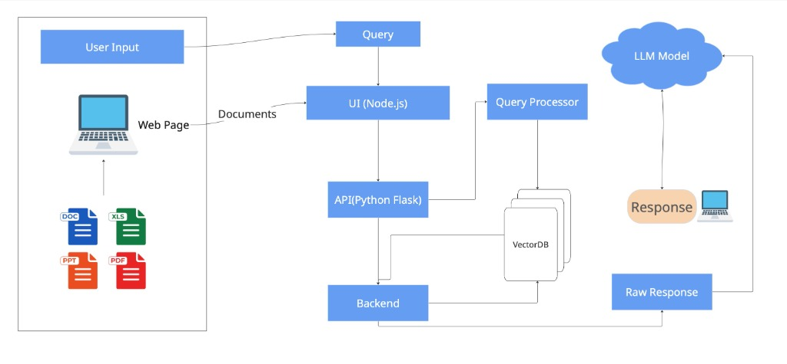

# HCL Tech Hackathon - AI Python Project

[](https://opensource.org/licenses/MIT)
[](https://www.python.org/downloads/)
[]()

> A cutting-edge AI solution designed for the HCL Tech Hackathon, leveraging Python to solve real-world problems through advanced machine learning algorithms.

---

## Table of Contents
- [About](#-about)
- [Architecture](#-architecture)
- [Key Features](#-key-features)
- [Requirements](#-requirements)
- [Tech Stack](#-tech-stack)
- [Installation](#-installation)
- [Usage](#-usage)
- [Team](#-team)

---

## About
The system accepts questions in a natural language (English) from the end user for the implied knowledge base to answer and resolve queries from the horde of PDF documents collected from open sources and fed to the system. The architecture supports any computer-readable PDF document and provides smart answers in natural language. The system provides answers to any query that is part of the knowledge base and ensures no outside knowledge invades the generated response.

---

## Architecture
This project utilizes a sophisticated pipeline to process documents and generate accurate responses.

### System Architecture


### Data Flow


### Workflow
1. **Document Processing**: `Pdf_doc` → **Txt_Extractor** → `Raw_Txt` (does OCR if length of extracted text is less than a predefined threshold).
2. **Embedding**: `Extracted_information` → **Embedding_FAISS_Indexing** → `Semantic Vector_Store`.
3. **Query Processing**: `User_Query` → **LLM** → `Summerized_txt_for_Semantic_Search`.
4. **Retrieval**: `Summerized_TXT` → **Vector_Query_Top_K** → `Top_Related_Documents`.
5. **Response Generation**: `Top_Related_Documents` → **LLM** → `Human_Friendly_Response`.
6. **Evaluation Set Creation**.
7. **Testing**: Ensuring proper knowledge extraction and knowledge base exclusive response extraction.
8. **Metrics**: Finding numerical evaluation metrics for evaluating system capability.

---

## Key Features

### Architectural Highlights
- **Hybrid LLM Support**: Supports both online API calls to the LLM (**GEMINI**) and offline LLM (**OLLAMA**) for privacy of sensitive documents.
- **Multi-Database Support**: Capable of handling multiple different databases simultaneously, each with options to choose the LLM preference.
- **Microservices Design**: Decoupled architecture using **Node.js** for the frontend UI and **Flask** for the backend API.

### User Centric Design
1. **Select Database**: Choose the specific knowledge base.
2. **Select LLM Source**: Toggle between online (Gemini) and offline (Ollama) models.
3. **Knowledge Management**: Option to add more documents or query the existing knowledge base.
4. **Natural Language Interface**: 
    - If **Query** selected: Returns a natural language response.
    - If **Add Document** selected: Provides interface to upload and index new documents.

### Evaluation Metrics
We find the numerical metrics (**MRR**, **Recall@2**, **Recall@5**, **ROUGE-1**, and **BLEU**) for evaluating the system performance.

---

## Requirements

### Prerequisites
- **OS**: macOS / Linux / Windows
- **Python**: version 3.10 or higher (for Flask API)
- **Node.js**: version 18+ (for UI)
- **Git**: for version control
- **Ollama** (optional, for local LLM support)

### Python Dependencies
See `requirements.txt` for specific versions.
- `flask`
- `flask-cors`
- `pandas`, `numpy` (Data Processing)
- `scikit-learn` (ML Utilities)
- `matplotlib`, `seaborn` (Visualization)

---

## Tech Stack
| Category | Technology | Purpose |
| :--- | :--- | :--- |
| **Backend** | Python (Flask) | RESTful API and ML Logic |
| **Frontend** | React.js | Interactive User Interface |
| **LLMs** | Gemini, Ollama | Natural Language Processing |
| **Vector DB** | FAISS | Semantic Search Indexing |
| **Data Processing** | Pandas, NumPy | Data manipulation |

---

## Installation

1. **Clone the repository**
   ```bash
   git clone https://github.com/your-username/hcl-hackathon-ai.git
   cd hcl-hackathon-ai
   ```

2. **Create Environment**
   ```bash
   conda create -n HCL python=3.10 -y
   conda activate HCL
   ```

3. **Install dependencies**
   ```bash
   pip install -r requirements.txt
   ```

4. **Run the application**
   ```bash
   streamlit run app.py
   ```

---


---

## Data Persistence & Schema
The system uses **MongoDB** to store chat history (`chats` collection) and file upload metadata (`uploads` collection). This ensures audit trails and evaluation datasets are preserved.

### Chat History Schema (`chats`)
Stores every user query, the internal RAG response (with metrics), and the external model response.


### File Uploads Schema (`uploads`)
Tracks all uploaded files, their processing status, chunk counts, and timestamps.


---

## Testing
We utilize personally handcrafted documents containing imaginary information for verification. This ensures that the end response is indeed only extracted from the knowledge base and no outside information invades the generated response, even after parsing through a SOTA LLM.

---

## Team: Excellent Mirror
| Name | Role | Email |
| :--- | :--- | :--- |
| **Praveen Kumar Jangir** | AI (PG) | praveen_2411ai26@iitp.ac.in |
| **Jaya Verma** | AI (PG) | jaya_2411mc17@iitp.ac.in |
| **Ruchika** | AI (PG) | ruchika_2411ai66@iitp.ac.in |
| **Tarun Mandal** | AI (PG) | tarun_2411ai33@iitp.ac.in |
